## The Booking Table

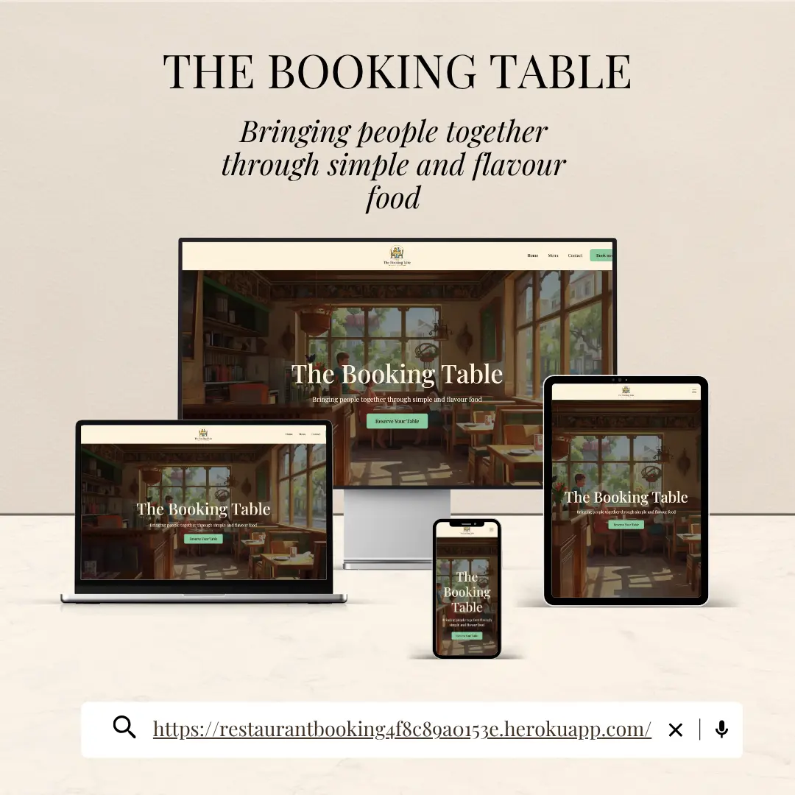

## Repository

[GitHub Repository](https://github.com/isadoraspirov/restaurant_booking)

The Booking Table is a restaurant booking website project designed to showcase full-stack web development skills using Django, HTML, CSS, Bootstrap, JavaScript, and database integration. The website provides users with a simple and convenient way to explore the restaurant menu, learn about the restaurant, and reserve tables online.

The project focuses on usability, responsive design, and efficient booking management. Users can browse menu categories, view restaurant information, and complete an online reservation form. The website is designed as an educational portfolio project demonstrating practical implementation of a booking system and CRUD functionality.

The purpose of this project is to demonstrate how a restaurant website can combine an attractive user interface with dynamic functionality through Django. The site allows users to make reservations while providing restaurant information in a clear and accessible format. It showcases skills such as database management, form handling, validation, responsive layouts, and user-focused design.

**Project Focus**

- Creating a responsive and accessible restaurant website.
- Implementing a booking system using Django forms and models.
- Practicing database management and CRUD functionality.
- Providing an intuitive user experience through clear navigation and modern design.
- Demonstrating server-side rendering and dynamic content management.

## Business Goals

- Promote the restaurant and its menu offerings.
- Provide customers with an easy online reservation process.
- Display restaurant contact information and opening hours.
- Demonstrate practical use of Django for booking management.

## User Goals

- View the restaurant menu and available dishes.
- Learn about restaurant contact details and opening hours.
- Reserve a table quickly and easily online.
- Receive confirmation after successfully submitting a reservation.

## Strategy

The strategy focuses on creating an elegant and welcoming restaurant website that encourages users to make reservations. The design prioritises simplicity, accessibility, and responsiveness across all devices. Django functionality supports form submission, booking confirmation, and database integration while maintaining a smooth user experience.

## Scope

**Must Have**

- Homepage with hero section and call-to-action button.
- Restaurant menu organised into categories.
- Online booking form connected to the database.
- Booking confirmation page displaying reservation details.
- Restaurant contact information section.
- Opening hours section.
- Responsive design using Bootstrap.

**Nice to Have**

- Booking management dashboard for administrators.
- Email confirmation after reservation submission.
- Customer account system.
- Online menu filtering and search.
- Google Maps integration showing restaurant location.
- Table availability checker.
- Customer reviews and ratings.

## Structure

The website structure guides users from discovering the restaurant to completing a reservation.

**Homepage**

- Hero image and welcome message.
- "Reserve Your Table" call-to-action button.
- Menu preview.
- Contact information.
- Opening hours.

**Booking Page**

- Reservation form.
- Customer details input.
- Date and time selection.
- Number of guests selection.
- Message require reservation.
- Form validation.

**Booking Confirmation Page**

- Confirmation message.
- Reservation details summary.
- Button to edit reservation.
- Button back to homepage.

**Footer**

- Copyright information.
- Navigation links.
- Contact details.

## Information Architecture

**Navigation**

Sticky navigation bar containing:

**Home | Menu | Contact | Book Now**

## Page Hierarchy

### Homepage

- Hero Section
- Menu Section
- Contact Information
- Opening Hours

### Booking Page

- Reservation Form
- Validation Messages

### Confirmation Page

- Booking Summary
- Return Home Button
- Edit Reservation Button

### Interaction

- Navigation links for smooth browsing.
- Form validation for reservation submissions.
- Dynamic booking confirmation page.
- Responsive menu cards with hover effects.
- Mobile-friendly navigation menu.

## Skeleton

### Priority Content**

**High Priority**

- Reserve Your Table call-to-action button.
- Online booking form.
- Restaurant menu.
- Contact information.
- Medium Priority
- Opening hours section.
- Booking confirmation page.

**Low Priority**

- Footer with additional information and navigation links.
- Future enhancements such as Google Maps and customer reviews.

## User Stories

### User Story 1: View Restaurant Overview

**Story:**

As a visitor I can view the restaurant homepage so that I can quickly understand what the restaurant offers.

**Acceptance Criteria:**

- The homepage displays restaurant name, short description, and branding.
- The homepage shows address and contact information.
- The homepage shows opening hours.
- The homepage contains a clear "Book a Table" button linking to booking page.
- The page is responsive on mobile and desktop.

### User Story 2: Submit a Booking Request

**Story:**

As a customer I can submit a booking request form so that I can request a table reservation.

**Acceptance Criteria:**

- Form includes required fields: name, email/phone, date request, time request, number of guests.
- Form includes optional field: special requests/message.
- Form cannot be submitted with empty required fields.
- Validation errors are shown if invalid data is entered.
- On successful submission, request is saved in the database.
- User sees a success message after submission and can edit reservation details.

### User Story 3: Admin View Booking Requests

**Story:**

As an admin I can view all booking requests so that I can respond and manage reservations.

**Acceptance Criteria:**

- Admin can view booking requests in Django Admin or a dashboard.
- Requests show key info: customer name, date, time, guests, message.
- Requests are ordered by newest first.

### User Story 4: Admin Update Request Status

**Story:**

As an admin I can update the request status so that I can track whether the booking is confirmed or rejected.

**Acceptance Criteria:**

- Each request has a status (Pending, Confirmed, Rejected).
- Default status is Pending when created.
- Admin can update the status manually.
- Updated status is saved and displayed correctly.

### User Story 5: Admin Manage Restaurant Info

**Story:**

As an admin I can update restaurant information so that the website stays accurate.

**Acceptance Criteria:**

- Admin can edit restaurant details (address, phone, email).
- Admin can update opening hours.
- Changes are reflected on the public website.

## Features 

**Navigation Bar**

- Fixed-top responsive navigation bar built with Bootstrap.
- Provides quick access to the Home, Menu,  Contact, and Booking sections.
- Mobile-friendly hamburger menu for smaller devices.
- Restaurant logo links users back to the homepage.

**Hero Section**

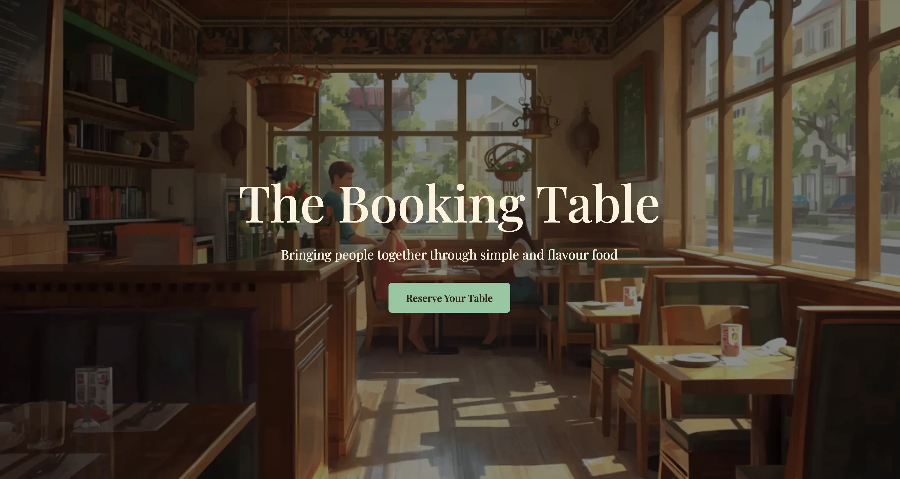

- Full-width hero section introducing The Booking Table.
- Clear call-to-action button encouraging users to reserve a table.
- Visually engaging design to create a welcoming first impression.

**Menu Section**

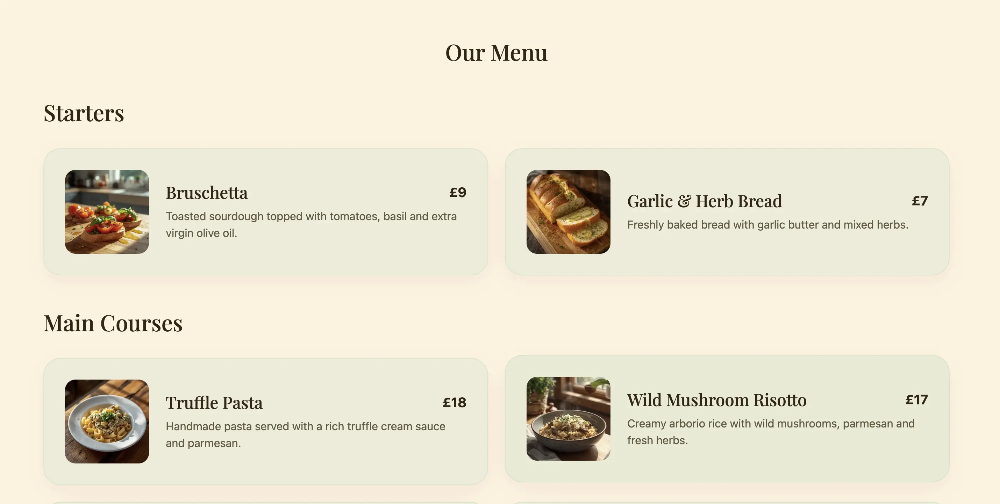
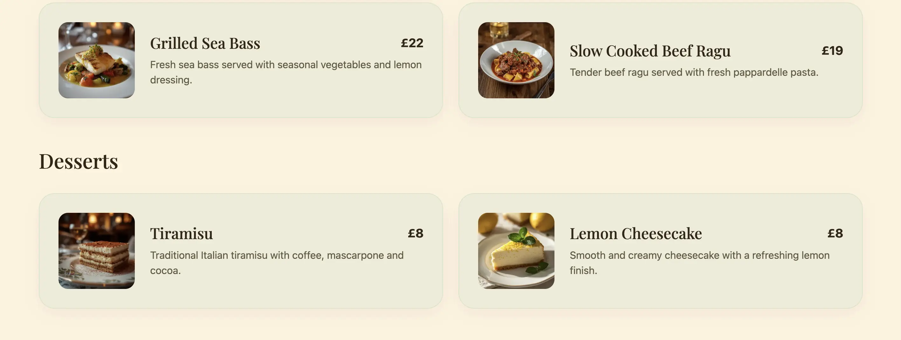

- Organised menu categories including Starters, Main Courses, and Desserts.
- Responsive menu cards displaying:
1. Dish image
2. Dish name
3. Description
4. Price
- Easy-to-read layout for desktop and mobile users.

**Restaurant Information Section**

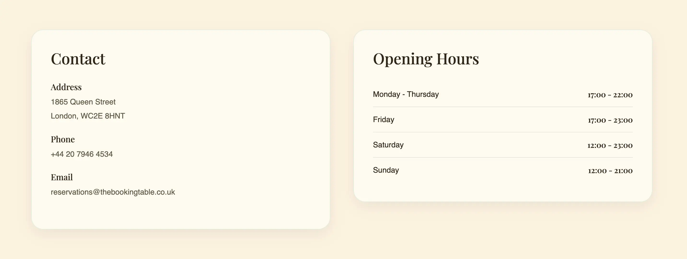

- Displays restaurant contact details including:
1. Address
2. Phone number
3. Email address
- Dedicated opening hours section showing weekly availability.

**Online Reservation System**

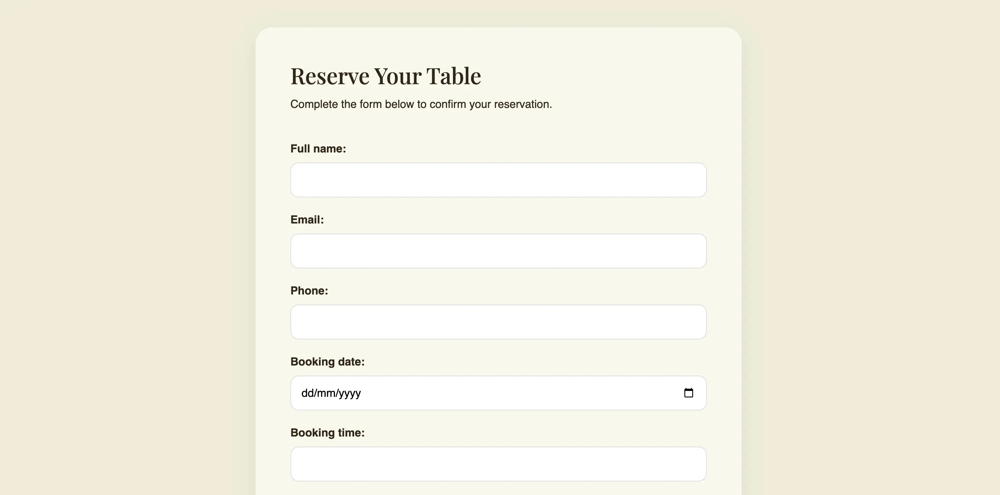
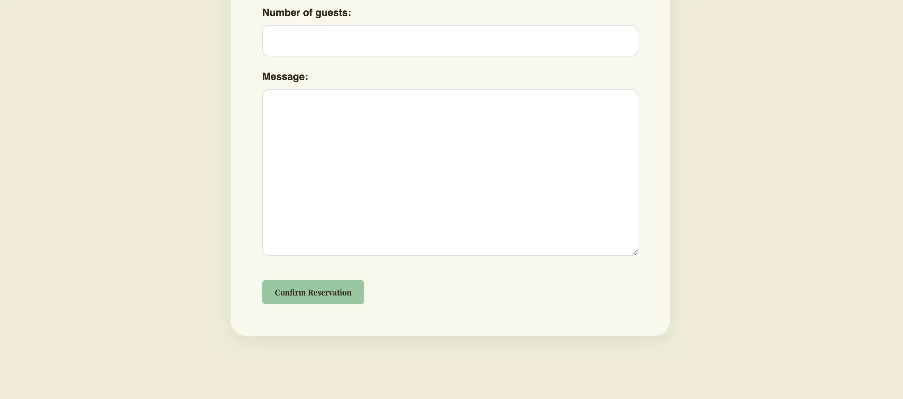

- Reservation form built using Django Forms.
- Users can submit:
1. Full name
2. Booking date
3. Booking time
4. Number of guests
- Form validation prevents invalid submissions.
- Data is stored in the database using Django models.

**Booking Confirmation**

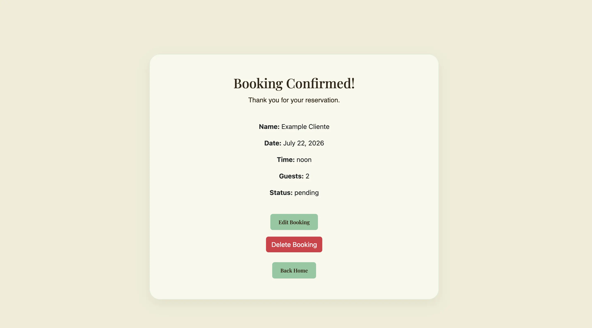

- Users receive a confirmation page after successful submission.
- Reservation details are displayed clearly.
- Includes navigation back to the homepage.

**Footer**

- Restaurant contact information details.
- Social media links.

**Responsive Design**

- Mobile-first responsive layout using Bootstrap 5.
- Optimised for desktop, tablet, and mobile devices.
- Consistent user experience across screen sizes.

## Technologies Used

**Languages**

- HTML5
- CSS3
- JavaScript
- Python

## Frameworks & Libraries

- Django
- Bootstrap 5.3

## Database

The project uses PostgreSQL as the production database and SQLite3 during development.

## Tools & Services

**Development Tools**

- Git
- GitHub
- VS Code
- Heroku
- PostgreSQL
- Django Admin

**Design Tools**

- Canva

**Validation Tools**

- W3C HTML Validator
- W3C CSS Validator
- JSHint
- Lighthouse

## Manual Testing

The website was manually tested across multiple browsers and devices.

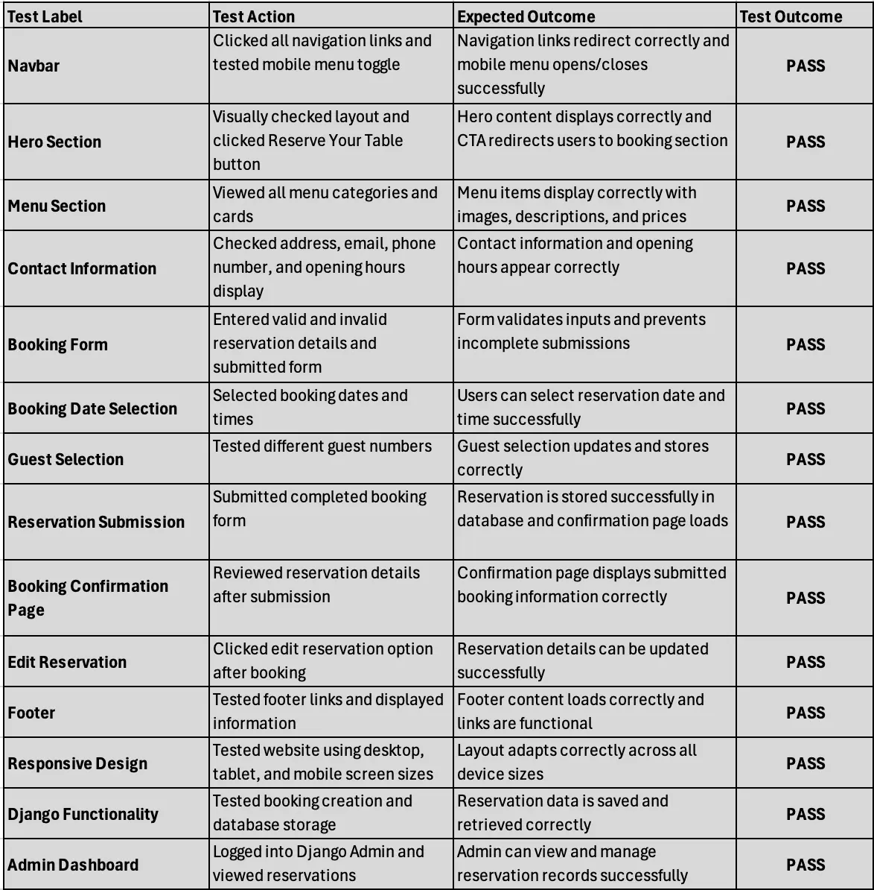

**Browser Compatibility**

Tested and confirmed working on:

- Google Chrome
- Mozilla Firefox
- Microsoft Edge
- Safari

**Responsiveness**

Verified on:

- Mobile devices
- Tablets
- Desktop screens

## User Stories Testing

**User Story 1 — View Restaurant Overview**

- Homepage displays restaurant information	
- CTA redirects correctly	
- Responsive design

**User Story 2 — Submit Booking Request**

- Form validation with success
- Data saved with success
- Confirmation displayed

**User Story 3 — Admin View Booking Requests**

- Admin sees bookings	
- Ordered correctly

**User Story 4 — Admin Update Status**

- Status editable
- Updates stored

**User Story 5 — Admin Manage Restaurant Info**

- Admin edits details
- Website updates

## Automated Testing with Lighthouse

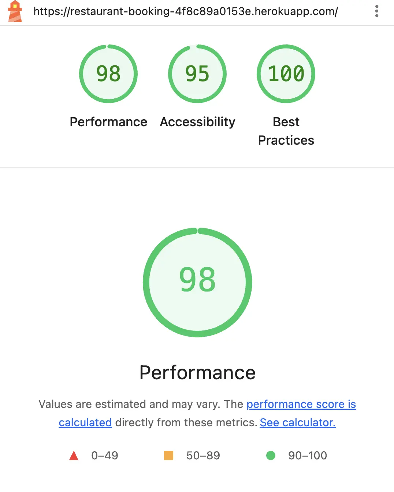

## HTML, CSS and JShint validation

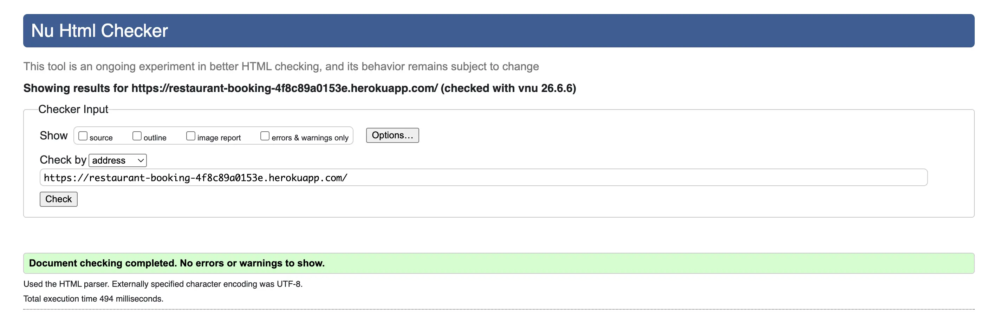
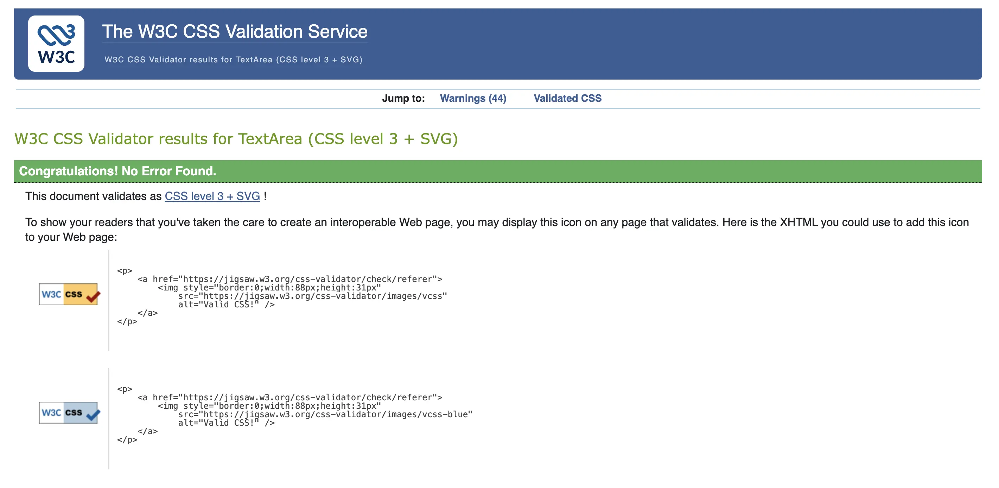
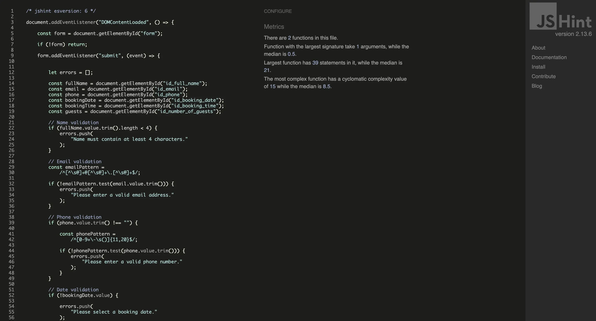

## Known Issues

- Booking availability is not restricted by real-time table capacity.
- Email confirmation functionality not yet implemented.
- Google Maps integration planned for future development.

## Future Features

Planned future improvements:

- Customer login and registration
- Email booking confirmation
- Booking availability checker
- Admin booking dashboard
- Restaurant reviews and ratings
- Online ordering system

## Deployment

The project is deployed using Heroku.

**Deployment Steps**

1. Create a Heroku account.
2. Create a new app.
3. Connect GitHub repository.
4. Configure environment variables:
- SECRET_KEY
- DATABASE_URL
5. Add Heroku PostgreSQL.
6. Deploy from GitHub.
7. Open the deployed application.

**Clone Repository**

git clone https://github.com/YOUR-USERNAME/YOUR-REPOSITORY.git

**Fork Repository**

- Open repository.
- Click Fork.
- Clone your fork locally.

## Credits

**Content**

- Restaurant content created for educational purposes.

**Media**

Images generetade via AI.

**Technologies**

Django Documentation
Bootstrap Documentation

**Artificial Intelligence Usage**

Artificial Intelligence (AI) tools were used during the development of this project to support planning, documentation, and code improvement.

- Assisted in writing and refining project documentation.
- Helped organise README sections and project structure.
- Supported debugging and troubleshooting during development.
- Generated suggestions for improving accessibility and responsiveness.
- Assisted with planning user stories and testing scenarios.

All code implementation, testing, debugging, and final decisions were completed and reviewed manually. AI-generated suggestions were evaluated and adapted to fit project requirements.

**Acknowledgements**

Special thanks to:

Mentor Kevin Loughrey for his guidance, support, and feedback throughout the project.
